# PR #141 — REST state visual review

Actual SwiftUI views captured in an iPhone 17 simulator (iOS 26.5, portrait). All names and content are synthetic fixtures: Alex, Riley, Feed the cat,
Veggie tacos, Milk, and Lake afternoon. No household data is included.

**Before:** PR head `71a4ee2a` integrated with current main (including #133 and #140)
at `a18fe9e5`, with only model injection and the screenshot harness added. Its Today
fetchers retain the old optional-result behavior. **After:** the fixes in this PR.
Family, Approvals, and Photos already had their first migration in the before build;
those comparisons verify preservation while Today and the shared notice change.

Each surface has four states: pending first load; successful empty response; initial
HTTP 503 failure; and successful fixture load followed by HTTP 503. The stale scenario
keeps the last confirmed data visible. Capture time is the fixture's saved-data time.
Phone Today is scrollable; the images show the initial viewport, including its
approvals entry point and dinner card.

The opt-in `RestScreenshotTests` hosts the shipping views, injects fetch outcomes,
and exports XCTest attachments plus PNGs into the simulator app's
`Documents/RestScreenshots`. Set `WAFFLED_CAPTURE_REST=1` in the test runner environment
and run only `WaffledTests/RestScreenshotTests`. Ordinary test runs skip this harness.

## iPad capture status

The iPad before/after set remains outstanding. Three local iPad simulator attempts
failed before the Waffled test host started: a new iOS 26.5 device, an existing iOS
18.2 device (whose bootstatus explicitly reported Data Migration Failed), and a fresh
iOS 18.2 device. The iPhone suite and captures succeed on the same code. A shared
CoreSimulator service restart is awaiting approval because it stops unrelated running
simulators. No iPad screenshot or verification is claimed here.

## iPhone 17

### Today

| State | Before | After |
|---|---|---|
| First load | 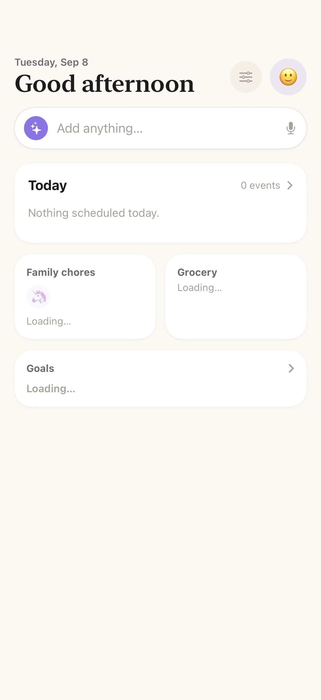 | 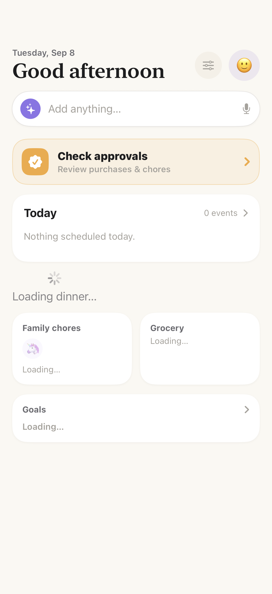 |
| Successful empty response | 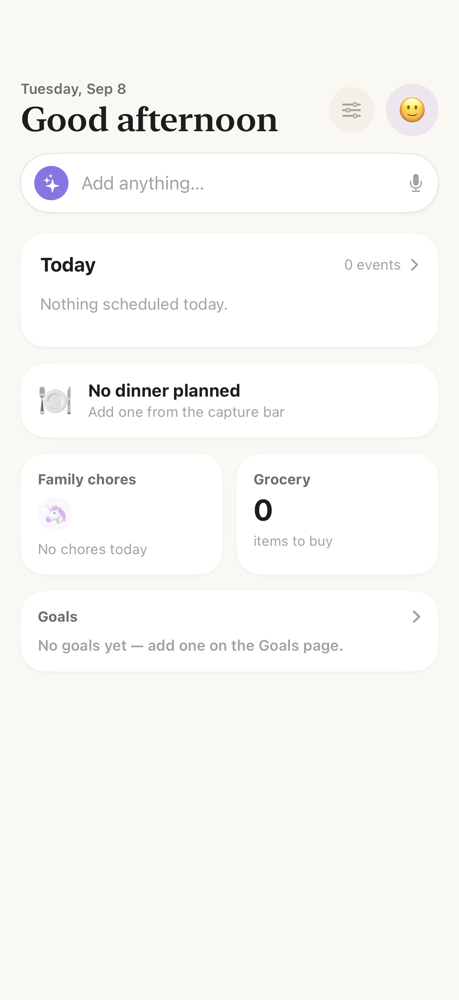 |  |
| Failed initial load (HTTP 503) |  | 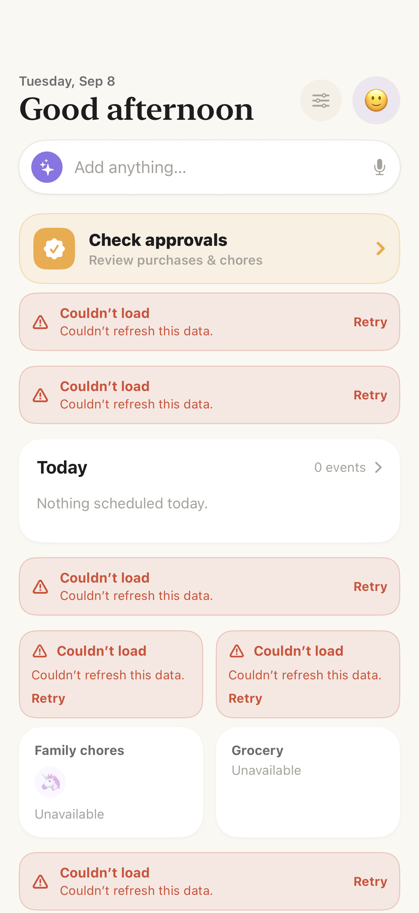 |
| Failed refresh after a successful load | 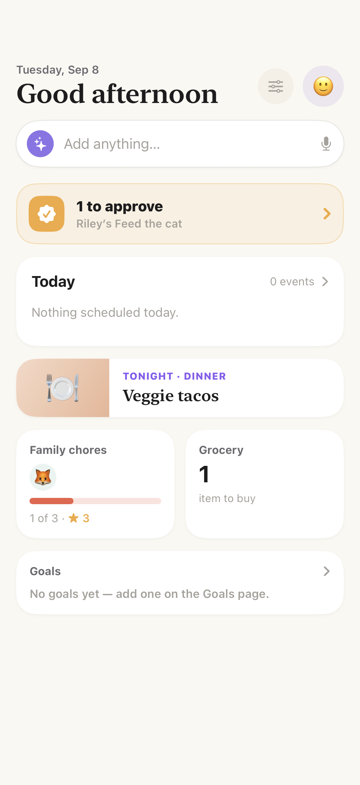 | 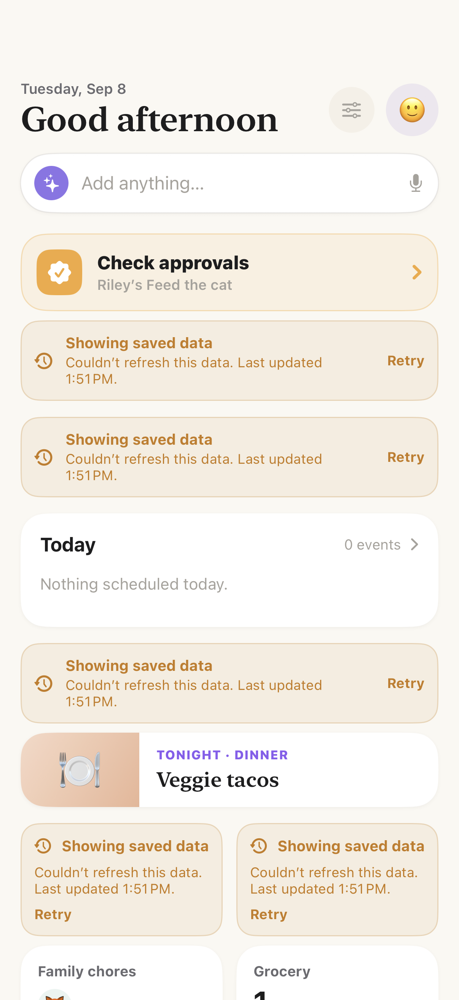 |

### Family

| State | Before | After |
|---|---|---|
| First load | 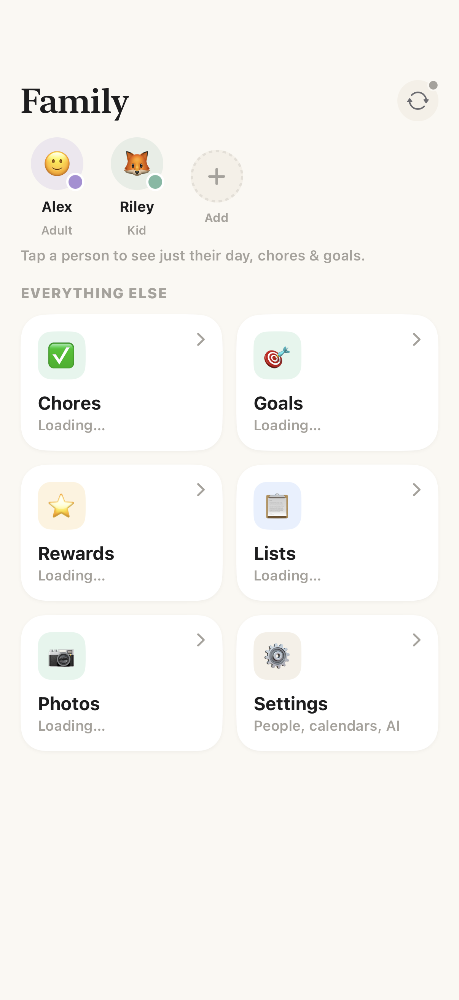 |  |
| Successful empty response |  | 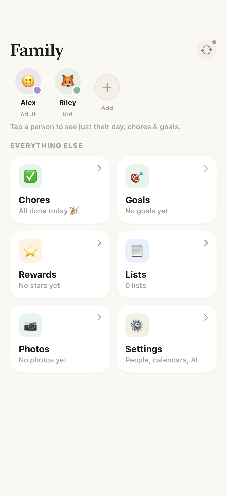 |
| Failed initial load (HTTP 503) | 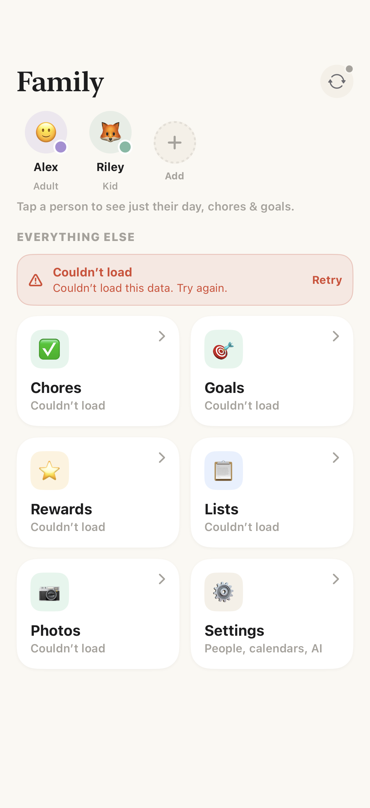 | 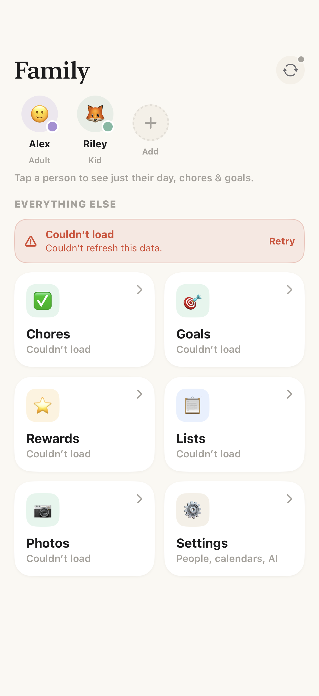 |
| Failed refresh after a successful load |  | 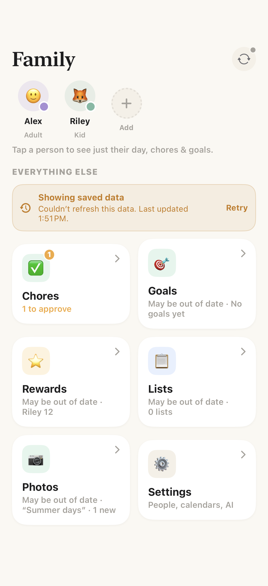 |

### Approvals

| State | Before | After |
|---|---|---|
| First load |  | 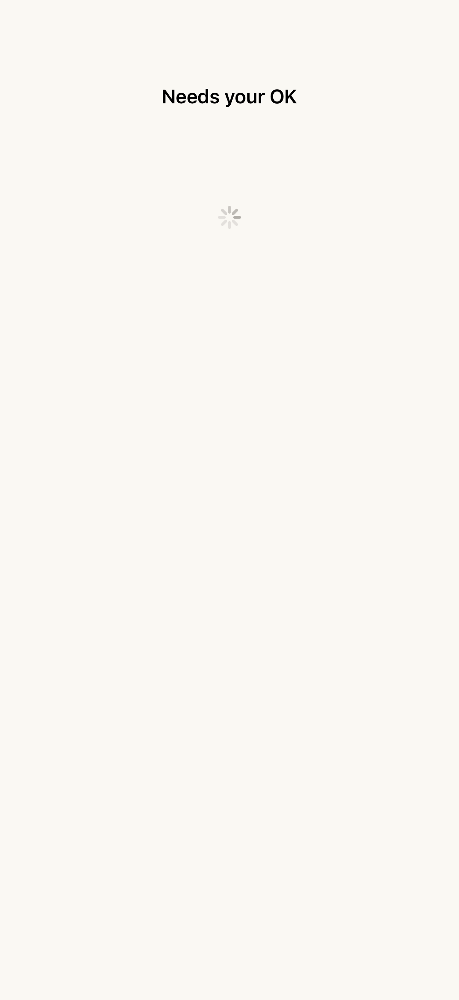 |
| Successful empty response |  |  |
| Failed initial load (HTTP 503) | 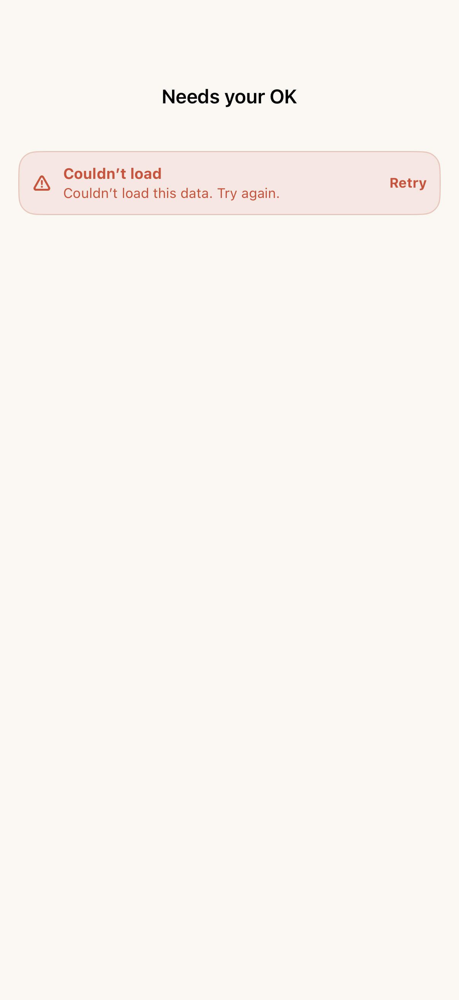 | 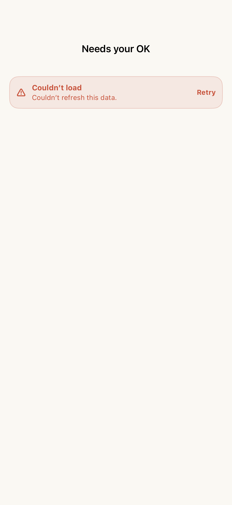 |
| Failed refresh after a successful load |  | 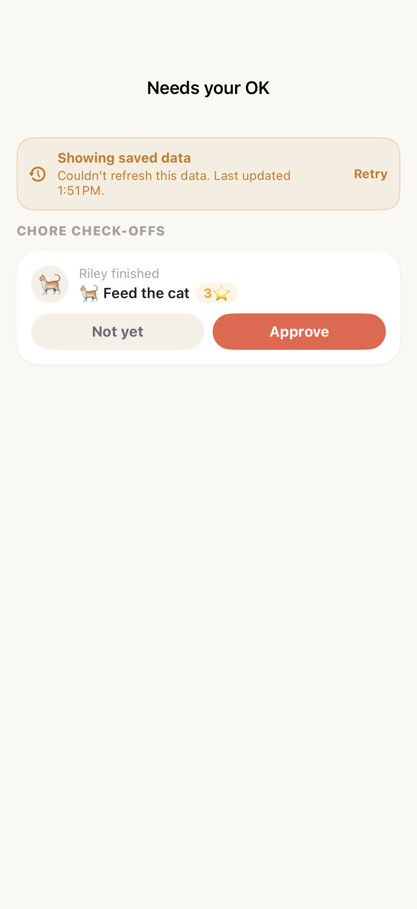 |

### Photos

| State | Before | After |
|---|---|---|
| First load |  | 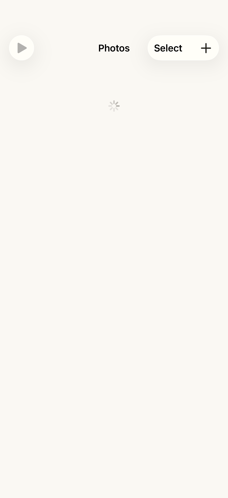 |
| Successful empty response |  |  |
| Failed initial load (HTTP 503) | 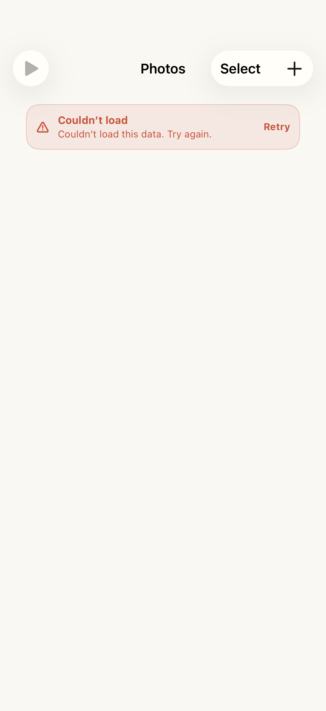 | 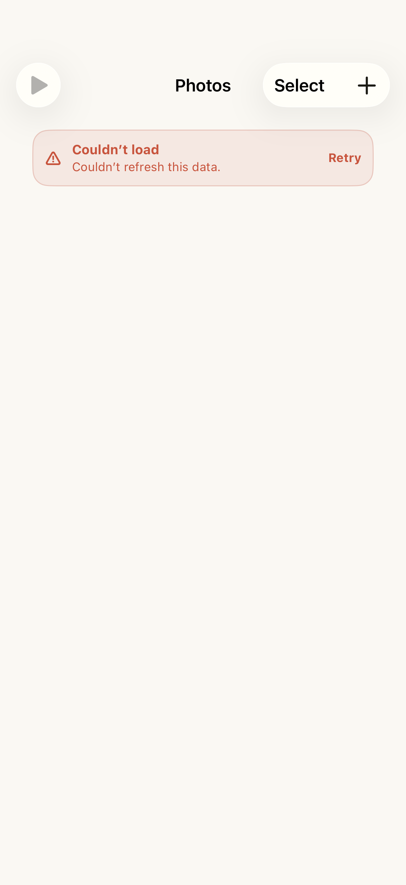 |
| Failed refresh after a successful load |  | 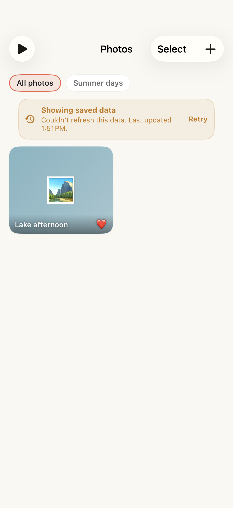 |
